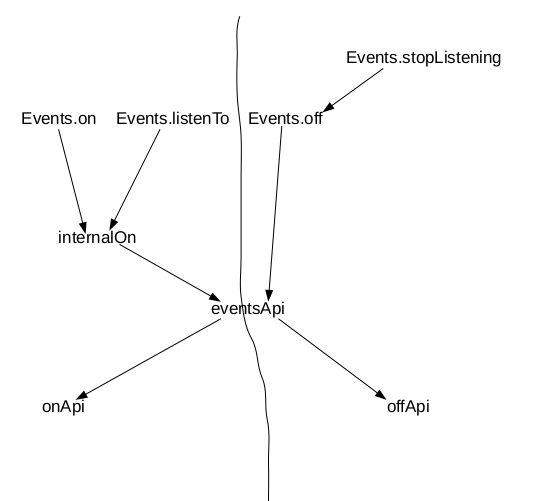

# Backbone's Events Module
Backbone itself implement an event system supporting non-DOM events. This module is sophisticated and worth learning. This note will analyze the source code of Backbone step by step. All neccessary source code will be pasted and well commented on almost each line, just so you don't have to reference another page of source code.

## Pub/Sub pattern
**Pub/sub** is a pattern with 2 types of objects - publishers & subscribers. Publishers & subscribers interact with each other through events. It is not to say that they need not know each others existence. In simple cases, they don't need to; in Backbone, they do, though.

Before getting dirty, here's a PubSub class for you to get a feel of this pattern. For simplicity, I'll assume there's only 1 object, being both subsriber and publisher. Later on you can complicate it a bit more.

```js
class PubSub {
    publish(eventName) {
        const handlers = this._events && this._events[eventName];
        if (!handlers)  return;     // No listener is registered.

        handlers.forEach(handler => {
            const { callback, context } = handler;
            const args = Array.prototype.slice.apply(arguments);
            args.shift();
            callback.apply(context || this, args);
        });
    }

    /**
     * @param {String} eventName the name of the event.
     * @param {Function} callback cb
     * @param {Object} context option context.
     */
    subscribe(eventName, callback, context) {
        const eventsObj = this._events || (this._events = {});
        const handlers = eventsObj[eventName] || (eventsObj[eventName] = []);

        handlers.push({ callback, context });
    }

    /**
     * Unsubscribe an event.
     * If no event is specify, do nothing.
     * @param {String} eventName 
     * @param {Function} callback [Optional] 
     * @param {Object} context [Optional]
     */
    unsubsribe(eventName, callback, context) {
        const handlers = this._events && this._events[eventName];
        if (!handlers)  return; // Nothing to unsubscribe.

        // If no `callback` is specified, delete all callbacks for this event.
        if (!callback) {
            handlers.splice(0, handlers.length);
        } else if (!context) {
            for (let i = 0; i < handlers.length; i++) {
                if (handlers[i].callback === callback)
                    delete handlers[i];
            }
        } else {
            for (let i = 0; i < handlers.length; i++) {
                if (handlers[i].callback === callback &&
                    handlers[i].context === context)
                    delete handlers[i];
            }
        }
        return this;
    }
}

// Usage
const someObj = new PubSub();
someObj.subscribe("music", function(song) { console.log(`Playing ${song}!`) });

someObj.publish("music", "Ne-Yo - Mad");    // => Playing Ne-Yo - Mad!
```

You can easily create a "pub/sub-able" object or class by extending it:

```js
// Create a pub/sub-able object.
const pubSubable = Object.create(PubSub.prototype);
pubSubable.subscribe("movie", function(name) { console.log(`${name}`) })

setTimeout(() => { pubSubable.publish("movie", "Darkest Hour") }, 1000);

// Create a pub/sub-able class.
class Custom extends PubSub { }

const custom = new Custom;
custom.subscribe("react", function(article) { console.log(`${article}`) });

new Promise((resolve, reject) => {
    setTimeout(() => {
        resolve(
            custom.publish("react",
                "React is a javascript library for building UI")
        
        );
    }, 1000);
}).then((custom) => {
    return custom.unsubsribe("react");
}).then((custom) => {
    // no handlers will be triggered.
    custom.publish("react", "Something else");
    custom.publish("react", "Pretty dumb");
    custom.publish("react", "I don't know what");
});
```

This implementation is trivial though, just make sure you understand **pub/sub** pattern such that you can dive deeper.

## Backbone's Events Module
To have a basic impression of its workflow, here's a callgraph:



Public APIs(`trigger`, `once` & `listenToOnce` are omitted) are listed on the top. Notice that all them will call `eventsApi`, which is an internal function that handles different styles of events. For example, these calls are equivalent:

```js
// 1. space-separated
book.on("change:title change:author", function(message) { }, this);

// 2. jQuery-style
function handler(message) {}
book.on({
    "change:title": handler,
    "change:author": handler
}, this);

// 3. Standard
function handler(message) {}
book.on("change:title", handler);
book.on("change:author", handler);
```
Handling different styles of parameters is typically done by identifying their types and rearranging them:

```js
// Source code of `eventsApi`

/**
 * Dispatches to corresponding api.
 * 
 * @param {Function} iteratee Underlying implementation of api.
 * @param {Object} events internal representation of events object.
 * @param {String|Object} name event name or eventName/callback pairs.
 * @param {Function|Object} callback callback or context for callback
 * @param {Object} opts Other options to pass to underlying implementation.
 * @returns An internal representation of events
 */
var eventsApi = function(iteratee, events, name, callback, opts) {
    var i = 0, names;

    // jQuery-style
    if (name && typeof name === 'object') {
        // In this case, `callback` is filled with a context.
        // Map it to `opts.context`
        if (callback !== void 0 && 'context' in opts && opts.context === void 0)    opts.context = callback;
        for (names = _.keys(name); i < names.length; i++) {
            events = eventsApi(iteratee, events, names[i], name[names[i]], opts);
        }
      // space-separated
    } else if(name && eventSplitter.test(name)) {
        for (names = name.split(eventSplitter); i < names;length; i++) {
            events = iteratee(events, names[i], callback, opts);
        }
      // Standard
    } else {
        events = iteratee(events, name, callback, opts);
    }
    return events;      // For chaining operations.
}
```
It is clear to see that `eventsApi`'s jobs:

1. Handle different styles of events
2. Dispatch public APIs to corresponding implementations(`onApi` or `offApi`)

Avoiding duplications by extracting a dispatcher function is a kind of good design because you wouldn't want to handle different styles in every public API's implementation.

Next up, let's go through `.on` API first.
**Before diving into the source code, one important point to bare in mind is, always keep the interfaces of every layer in consistency.** `Backbone.Events` module is a very good example. Here's the shape of every underlying implementation of public API:

**(.)+Api(eventsObj, eventName, callback, options)**

where
- `eventsObj` {Object}:
    an internal hash of `eventName/handlers` pairs (`handlers` is an array of `handler`. I'll talk about `handler` pretty soon, for now just remember it is an object)
- `eventName` {String}:
    an event name
- `callback` {Function}:
    a callback function
- `options` {Object}:
    this object contains **context**, **ctx** & **listening** fields. **context** is used as the context of `callback`. In personal opinion, **ctx** is something extra. Omit **listening** for a second.

```js
/**
 * @param {String|Object} name different styles of events
 * @param {Function|Object} callback a callback or context for cb.
 * @param {Object} context optional context
*/
Events.on = function(name, callback, context) {
    return internalOn(this, name, callback, context);
}
/**
 * Guards the `listening` object.
 * @param {Object} obj the object to set up internal events
 * @param {String|Object} name different styles of events
 * @param {Function|Object} callback a callback or context for cb.
 * @param {Object} context optional context.
 * @param {Object} listening We now omit it for a second. 
 */
var internalOn = function(obj, name, callback, context, listening) {
    // eventsApi will call onApi, with rest of the params
    obj._events = eventsApi(onApi, obj._events || {}, name, callback, {
        context: context,       // I think it is extra.
        ctx: obj,               // context for `callback`
        listening: listening    // Ignore it for a second.
    });

    // Ignore this if-statement.
    if (listening) {
        var listeners = obj._listeners || (obj._listeners = {});
        listeners[listening.id] = listening;
    }

    return obj;
}

/**
 * Underlying implementation of `.on` & `.listenTo`.
 * Register an event on an internal `events` object.
 * 
 * @param {Object} events internal representation of events object.
 * @param {String} name event name.
 * @param {Function} callback callback 
 * @param {Context: {Object}, ctx: {Object}, listening: {Object}} opts
 */
var onApi = function(events, name, callback, options) {
    if (callback) {
        // If `handlers` array doesn't exist, create one
        var handlers = events[name] || (events[name] = []);
        var context = options.context,  // I think it is extra
            ctx = options.ctx,          // context for `callback`.
            listening = options.listening; // Ignore it for a second.

        if (listening)  listening.count++; // Ignore it for a second.
        handlers.push({
            callback: callback,
            context: context,       // I think it is extra
            ctx: context || ctx,    // context for `callback`
            listening: listening    // Ignore this field for a sec.
        });
    }

    return events;
}
```
Now you should be knowing how `.on` method works, even if there still remain 2 mystories:

1. What is `listening` object for?
2. Why would the author set up an `internalOn` method instead of putting those setups inside `.on` method.

You've already seen the call graph, just so you've got the answear to the second question - **`internalOn` is an extraction function from `.on` and `.listenTo` API. Then you would've guessed `listening` is some object for setting up, say, an object A to listen to another object B.**

If you think in this way, you hit the right direction. Now if you take a look into `.listenTo` method, you'll see what is the `listening` object(I'll comment it in terms of **publisher** & **subscriber**, e.g. **publisher.listenTo(subscriber, "change", function() {});**):

```js
/**
 * Usage: subscriber.listenTo(publisher, "message", ()=>{});
 * the callback will always be called with subscriber as its context.
 * @param {Object} obj publisher.
 * @param {String} name event name
 * @param {Function} callback cb. 
 */
Events.listenTo = function(obj, name, callback) {
    if(!obj)    return this;
    // both publisher & subscriber need to have unique IDs. Prefix with 'l'.
    var id = obj._listenId || (this._listenId = _.uniqueId('l'));
    // subscriber._listeningTo.
    var listeningTo = this._listeningTo || (this._listeningTo = {});
    var listening = listeningTo[id];    // The listening object

    if (!listening) {
        var thisId = this._listenId || (this._listenId = _.uniqueId('l'));
        listening = listeningTo[id] = {
            obj: obj,   // Publisher
            objId: id,  // Publisher's _listenId
            id: thisId, // subsriber's _listenId
            listeningTo: listeningTo,    // subscriber's _listeningTo
            count: 0    // How many events subscriber listenTo publisher.
        }
    }

    // Set it to publisher's internal event object.
    internalOn(obj, name, callback, this, listening);
    return this;
};
```
The `listening` object now has a shape as shown in the above code. There are 2 fields to explain:

- **subscriber._listeningTo: {Object}**
    It is an object holded by a subscriber, with keys = `_listenId` of publishers, values = `listening` objects.
- **publisher._listener: {Object}**
    It is an object holded by a publisher, with keys = `_listenId` of subscribers, values = `listening` objects.

Take a look back to `internalOn` function, that Ignored if-statement:

```js
// Ignore this if-statement.
if (listening) {
    var listeners = obj._listeners || (obj._listeners = {});
    listeners[listening.id] = listening;
}
```
Thus far, we know that `internalOn` function guards the `listening` object. a `listening` object is a link between a subscriber & a publisher. Let me put it straight forward(equivalent operations):

    listening = subscriber._listeningTo[publisher._listenId];
    publisher._listeners[subscriber._listenId] = listening

As a reminder, suppose there are a subscriber, publisher1 and publisher2, subscriber listens to both publishers. The following 2 approaches are equivolent:

```js
// 1. use .on
function handler(message) { /* ... */}
publisher1.on("message", handler, subscriber);
publisher2.on("message", handler, subscriber);

// 2. use .listenTo
function handler(message) { /* ... */}
subscriber.listenTo(publisher1, "message", handler);
subscriber.listenTo(publisher2, "message", handler);
```

If you need to unbind those events, with the first approach, you do the following:

```js
publisher1.off("message", handler);
publisher2.off("message", handler);
```

With the second approach, only 1 operation is required:

```js
subscriber.stopListening();
```

Here's the implementation of `stopListening` & `offApi` with detailed comment(for simplicity, I omitted some code to let you focus on point):
```js
 // A subscriber calls this method.
Events.stopListening = function(obj, name, callback) {
    var listeningTo = this._listeningTo;
    if (!listeningTo) return this;

    var ids = obj ? [obj._listenId] : _.keys(listeningTo);

    for (var i = 0; i < ids.length; i++) {
        var listening = listeningTo[ids[i]];
 
        if (!listening) break;
 
        // Tell the publisher to call `.off` method with `callback`
        // & `this` as context.
        listening.obj.off(name, callback, this);
    }
 
    return this;
};
var offApi = function(events, name, callback, options) {    
    ...
    var context = options.context, listeners = options.listeners;
    ...
    // If name is undefined, all events will be set to `names`
    var names = name ? ... : _.keys(events);
    for (; i < names.length; i++) {
        name = names[i];
        // Get all handlers of a specific event.
        var handlers = events[name];

        if (!handlers) break;   // No events at all.

        for (var j = 0; j < handlers.length; j++) {
            if (...)
            else {
                listening = handler.listening;
                if (listening && --listening.cout === 0) {
                    // Delete both items in publisher & subscriber
                    delete listeners[listening.id];
                    delete listening.listeningTo[listening.objId];
                }
            }
        }

        if (...)
        else
            delete events[name];
    }
}
```
When a subscriber calls its `stopListening` method without any param, the code above will be execued, omitted code will be omitted. Shortly speaking, a subscriber finds the all publishers using its `_listeningTo` attribute, all these publishers delete corresponding items in their `_listeners` attribute, then delete those items in subscriber's `_listeningTo` attribute. Finally delete handlers object.

Next time this subscriber calls `stopListening` again, it woundn't find anything in its `_listeningTo` attribute. 

## trigger API
Once you completely understand `on`, `listenTo`, `stopListening` & `off`, `trigger` is easy. One optimization to notice is inside the `triggerEvents`: if we know how many args in advance, we can just use `call` instead of `apply` on a callback.

```js
// triggerEvents function.

    switch (args.length) {
      case 0: while (++i < l) (ev = events[i]).callback.call(ev.ctx); return;
      case 1: while (++i < l) (ev = events[i]).callback.call(ev.ctx, a1); return;
      case 2: while (++i < l) (ev = events[i]).callback.call(ev.ctx, a1, a2); return;
      case 3: while (++i < l) (ev = events[i]).callback.call(ev.ctx, a1, a2, a3); return;
      default: while (++i < l) (ev = events[i]).callback.apply(ev.ctx, args); return;
    }
```