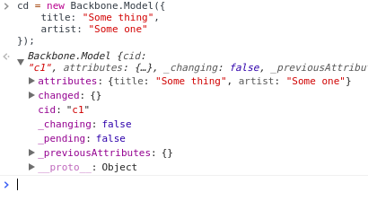

I'll be talking about the `Backbone.Model` in this page. Everything is related to it.

## Initilization
When creating a model instance, here's its shape:



- **attributes** {Object}: a set of data being managed by the model instance
- **changed** {Object}: a hash of changed attributes
- **cid** {Object}: a client-side id
- **_changing** {Boolean}: indicates if there is any `set` method on the program stack. (I'll explain later)
- **_pending** {Boolean}: if there's any pending changes. (explain later)
- **_previousAttributes** {Object}: stores previous values of changed attributes.
- **__proto__** {Object}: Backbone.Model.prototype

Attributes prefixed with an underscore character is considered to be private. Most of these properties are straight forward, here's a the constructor:

```js
  var Model = Backbone.Model = function(attributes, options) {
    var attrs = attributes || {};
    options || (options = {});

    // Set up a unique client-side id for this instance
    this.cid = _.uniqueId(this.cidPrefix);
    this.attributes = {};
    // You don't manually set up this option.
    if (options.collection) this.collection = options.collection;
    // If a parse method is specified, call it to parse
    // the `attributes` passed in.
    if (options.parse) attrs = this.parse(attrs, options) || {};
    var defaults = _.result(this, 'defaults');
    // Patch default values into `attributes`
    attrs = _.defaults(_.extend({}, defaults, attrs), defaults);
    // set will validate your attributes by calling `validate`
    // that you set up on extending the class.
    this.set(attrs, options);
    // Currently no changed attribute.
    this.changed = {};
    // this method will be an empty function if you don't provide
    // one.
    this.initialize.apply(this, arguments);
  };
```

## `set` method
Basically, this method is the most important method in `Model` module. If this method run successfully, it will trigger `change:attrName` event, such that it is handy for you to attach a handler to it.

There are 2 styles to set attributes:

```js
// 1. Update an attribute a time
cd.set(title: "Havana");

// 2. Update several attributes a time
cd.set({
    title: "Havana",
    artist: "Camila"
});
```

Handling this is simple:

```js
set: function(key, val, options) {
  if (key == null) return this;
  var attrs;
  // the 2nd style
  if (typeof key === 'object') {
    attrs = key;
    options = val;
  } else { // the first style.
  
    (attrs = {})[key] = val;
  }

    ...
```
Next up, before setting the new values to `this.attributes`, `set` calls `this._validate(attrs, options)` which will in turn call the `validate` function you have just passed in on extending `Backbone.Model`:

```js
set: function(key, val, options) {
    ...
    option || (option = {});

    if (!this._validate(attrs, options)) return false;

    var unset      = options.unset;
    var silent     = options.silent;
    var changes    = [];
    // Notice this line.
    var changing   = this._changing;
    // setting the current _changing to true
    this._changing = true;

    if (!changing) {
        this._previousAttributes = _.clone(this.attributes);
        this.changed = {};
    }
}
```
If `changing` is true, it means some frame(s) of `set` method is(are) in the program stack & attributes values are changed already. Thus, the current attributes value should be preserved before continuing the current active `set`.

Another important point to notice is `option || (option = {})`. The `option` object here will be assigned to `this._pending` after `this.attributes` are set to new values:

```js
set: function(ket, val, options) {
  ...
  options || (options = {});

  ...
  // Set this.attributes
  for (var attr in attrs) {
    val = attrs[attr];
    if (!_.isEqual(current[attr], val)) changes.push(attr);
    if (!_.isEqual(prev[attr], val)) {
      changed[attr] = val;
    } else {
      delete changed[attr];
    }
    // if `unset` is true, delete this attr
    unset ? delete current[attr] : current[attr] = val;
  }

  // `this.id` also needs to be updated.
  if (this.idAttribute in attrs) this.id = this.get(this.idAttribute);

  if (!silent) {
    // Notice this line
    if (changes.length) this._pending = options;
    for (var i = 0; i < changes.length; i++) {
      this.trigger('change:' + changes[i], this, current[changes[i],options);
    }
  }

  if (changing) return this;
  if (!silent) {
    while (this._pending) { // Might be recursively nested
      options = this._pending;
      this._pending = false;
      this.trigger('change', this, options);
    }
  }
  this._pending = false;
  this._changing = false;
  return this;
}
```
The while loop above might be a little bit confusing. Consider if there's a case:

```js
var cd = new Backbone.Model({
  number: 5
});

cd.on("change", function changeHandler (model, options) {
  // Do something.
  var newNumber = model.get("number");

  if (newNumber >= 1) {
    // recuresively call `set`
    model.set({ number: newNumber - 2 }, options);
  }
});
```

In this case, suppose `cd.set({ number: 7 });`, think about it, each call to `changeHandler` will result in `this._pending` setting to a non-false value. Thus if it isn't a `while` loop, `changeHandler` will be triggered at the correct times.

## CRUD on Models

All CRUD methods delegate to `Backbone.sync`:

```js
// model.fetch(options)
this.sync('read', this, options)

// model.save
var method = this.isNew() ? 'create' : (options.patch ? 'patch' : 'update');
this.sync(method, this, options);

// model.destroy
this.sync('delete', this.options);
```

`save` method is quite smart. It can guess which method to use. If you know you're going to update a little piece of data, you should specify `patch: true` in your option.

## ES6 Style
You can extend `Backbone.Model` easily in ES6, just make sure `defaults` is a function:

```js
class MusicModel extends Backbone.Model {
  constructor(attributes) {
    super(attributes);
  }

  defaults() {
    return {
      title: "Unknown",
      artist: "Unknown"
    }
  },

  urlRoot() {
    return "/music";
  }
}
```