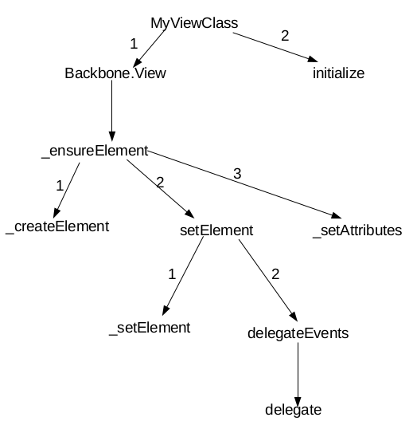

Backbone didn't tell us how we should render a view or how we should compose our view object. Flexible, though, we need to find another template engine. 

## Initialization
Backbone's View implementation is pretty straight forward. Here's a call graph when you `new MyView({ ... })`:



It is helpful if we look at this callgraph buttom-up.

- **createElement(tagName)**:
    simply return `document.createElement(tagName)`. TagName will be `div` if not specified manually. Note if you specify `el: elSelector` when extending Backbone.View, this method will not be called. You shouldn't set `el` inside `initialize` function manually, because this method will be called prior to `initialize`.

- **_setElement(el)**:
    Set `this.el` to a reference the real DOM element; `this.$el` to a jQuery wrapper of `this.el`.

- **delegate(eventName, selector, listener)**:
    Use jQuery's pub/sub lib.

- **delegateEvents(events)**:
    All events specified declaratively when extending `Backbone.View` will be passed in this method.

- **_setAttributes(attributes)**:
    this.$el.attr(attributes)

- **initialize**:
    You do whatever you want.

## Writing in ES6 Style

When writing `Backbone.View` in ES6, be careful because you have to wrap viewOptions up into functions:

```js
var viewOptions = ['model', 'collection', 'el', 'id', 'attributes', 'className', 'tagName', 'events'];

var View = Backbone.View = function(options) {
    _.extend(this, _.pick(options, viewOptions));
    ...
}
```

For example:

```js
class MyView extends Backbone.View {
    constructor(options) {
        super(options)
    }

    initialize() {
        this.listenTo(this.model, "change", render);
    }

    events() {
        return {
            "click .clickable": clickHandler
        }
    }

    tagName() {
        return "p"
    }

    render() {
        ...
    }
}
```